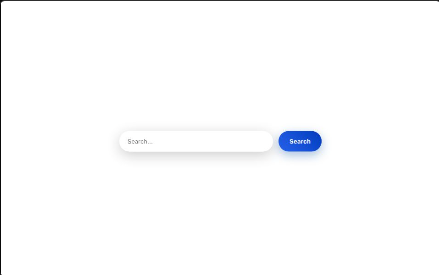

# NASA Image Search Engine

This project is a simple search engine UI built with [Svelte](https://svelte.dev/) that uses the [NASA Image and Video Library API](https://api.nasa.gov/). The app is deployed on Vercel; you can try it out at the [demo link](https://image-search-five-sigma.vercel.app/).

[](https://image-search-five-sigma.vercel.app/)
## Getting Started

First ,run the development server:


```sh
npm run dev
#or 
yarn dev
#or
pnpm dev
```
Open (http://localhost:5173) with your browser to the the result 

## UI Testing
we using playwright for auto UI test,run example test
```sh
npm run test:ui
```
